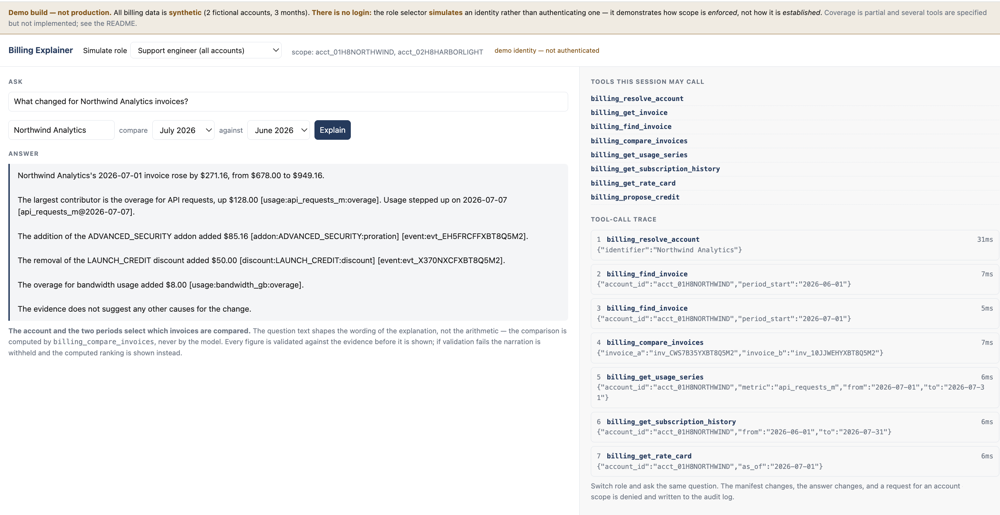

# Billing Explainer

**Ask "why did this account's bill go up?" and get a ranked, evidence-linked answer — from an MCP server with a real authorization model, not a chat wrapper.**

Built on Cloudflare Workers, the Agents SDK, D1, Durable Objects and Workers AI.

### ▶ **[Try it: billing-explainer.avanti-b4d.workers.dev](https://billing-explainer.avanti-b4d.workers.dev)**

### 📄 **[Prompt history (the assignment's required artifact)](docs/PROMPT-HISTORY.pdf)**

*Demo build. All data is synthetic — two fictional accounts, three months. There
is no login: the role selector **simulates** an identity rather than
authenticating one, which is the point of [§ "no login"](#about-the-demo) below.
Rate-limited to 40 model-backed investigations per hour.*



---

## The 30-second version

A billing question — *why did this invoice change, what is this customer entitled to* — is answered today by a human clicking through a dashboard, because the answer lives across four systems: subscriptions, usage metering, invoicing and the ledger.

This exposes those systems as **typed, permissioned tools an agent can call**, so the question resolves in one step instead of becoming a support ticket.

The interesting problem isn't calling an LLM. It's the one a chat UI lets you skip:

> **What is an agent allowed to read versus change, and how is that audited?**

Three answers this repo commits to:

- **The agent's write surface is its own workspace, never the ledger.** Twelve read tools, four writes, and **no agent-callable path that moves money**. `apply_credit` does not exist — the agent proposes with evidence, a human approves in a separately authenticated surface, the server applies.
- **`account_id` in a tool argument is a selector, not an authorization claim.** Scope rides in a signed token bound to the session; model output can never widen it. A refusal is recorded with the account that was asked for.
- **Compute in code, narrate in the model.** Invoice diffing is a full outer join, not a model task — arithmetic over a revenue document is where a fluent wrong answer is most expensive and least detectable.

**→ [Walkthrough with screenshots](docs/WALKTHROUGH.md)** · **[Why it's built this way](docs/DESIGN.md)** · **[Prompt history](docs/PROMPT-HISTORY.pdf)**

---

## Five things to try on the demo

Each one takes about fifteen seconds and shows a different property. The
right-hand panel is the tool-call trace — read it, it is the evidence that the
answer came from the billing systems rather than from the model.

**1. The question the whole thing exists for.**
Role **Support engineer** · account `Northwind Analytics` · **July 2026** vs **June 2026**
> *Why did Northwind Analytics' invoice go up in July?*

A 40% rise decomposing into three causes of different sizes — a usage step
change, a mid-period add-on prorated 16/31 days, and an expired promotional
discount. The smallest is the one a human scanning a dashboard reliably misses,
and it is found as a `NULL` on one side of a join rather than inferred from a
total that moved. **Every figure is computed in SQL; the model is forbidden to do
arithmetic and its output is checked before you see it.**

**2. The control — a boring account.**
Role **Support engineer** · account `Harborlight Media` · **July 2026** vs **June 2026**

A change of about −1%. Nothing is dramatised. This is here so that answer 1 reads
as a finding rather than as how the system always talks.

**3. Scope, enforced.**
Role **Customer — Northwind Analytics only** · account `Harborlight Media`

Refused, with an **empty tool-call trace**: the refusal happens before any
billing data is read, checked against the signed session token rather than
against the account id in the argument. Watch the tools panel as you switch
roles — it drops from eight entries to seven, and `billing_propose_credit`
disappears. That panel renders what the *server* returned to `tools/list`.

**4. Enumeration, prevented.**
Any role · account `Acme Corp` (or any name that does not exist)

The identical refusal. "Not found" and "not permitted" are indistinguishable to
the caller, so the error cannot be used to discover which accounts exist. The
audit log records which it actually was.

**5. The periods are real selectors.**
Role **Support engineer** · account `Northwind Analytics` · **July 2026** vs **May 2026**

Different pair, different arithmetic, same shape. The demo is not a canned
answer — and if you word the question differently, note that the *wording*
changes and the *numbers* do not.

> Account names must be typed exactly. `billing_resolve_account` matches an id or
> a full case-insensitive name, with no partial matching — a deliberate choice,
> since fuzzy resolution on a revenue document is a way to answer confidently
> about the wrong customer.

**If a narration is ever withheld,** that is the output validator working, not a
crash — you get the computed ranking plus the specific reason the prose failed
its check. [See what that looks like](docs/WALKTHROUGH.md#when-the-model-is-wrong).

---

## Run it yourself

```bash
npm install
npm run db:init          # schema -> local D1
npm run db:seed          # 2 accounts, 3 months
npm run verify:fixture   # 24 assertions on the demo arithmetic
npm test                 # 24 tests
npx wrangler login       # Workers AI is remote-only
npm run dev
```

Full setup, including deploying your own copy: **[docs/DEPLOY.md](docs/DEPLOY.md)**.

`npm run verify:fixture` proves the demo before any agent runs: **June $678.00 → July $949.16, +$271.16 = 39.994%**, decomposing exactly into a usage step change ($136.00), a prorated mid-period add-on ($85.16), and an expired discount ($50.00). The fixture is engineered, not plausible — a single-cause answer would prove nothing a dashboard filter couldn't do.

**Without a model, the system still answers.** Narration degrades to the computed ranking and says why. The arithmetic is the product; the prose is a layer over it.

---

## Where things are

| Path | |
|---|---|
| `src/db/scoped-db.ts` | The only route to the database. Scope cannot be forgotten — see [DESIGN](docs/DESIGN.md#1-scope-cannot-be-forgotten). |
| `src/mcp/guard.ts` | The enforcement path: scope check, audit write, fail-closed. |
| `src/audit/audit-do.ts` | Append-only, hash-chained audit log — and its [honest limit](docs/DESIGN.md#4-an-audit-trail-not-a-log). |
| `src/mcp/tools/compare-invoices.ts` | The deterministic diff the model is not allowed to do. |
| `src/agent/compose.ts` | The composition prompt **and the validator that checks the model obeyed it**. |
| `docs/tool-surface.md` | Full tool list, authorization boundary, write gating, negative space. |
| `docs/data-model.md` | Schema, the fixture's arithmetic, six ranked tenancy-leak vectors. |
| `docs/DEPLOY.md` | Step-by-step deploy, and the three things that only break once it leaves the laptop. |
| `docs/PROMPT-HISTORY.pdf` | Every prompt used to build this, with what it produced. |

## About the demo

**It is a demo, and two things about it are deliberately not production.**

**The data is synthetic** — two fictional accounts, three months, engineered so
the demo question has a layered answer. No real billing data exists anywhere in
this project.

**Identity is simulated, not authenticated.** There is no login. The role
selector mints a signed token with the requested scope, so anyone can choose to
be the support engineer. That is the honest boundary of what this demonstrates:
**how scope is *enforced*, not how it is *established*.** The enforcement is
real — scope rides in a signed token, is checked server-side on every call,
never comes from a tool argument, and every refusal is written to the audit log.
The issuing of that token is a stub standing in for Cloudflare Access and the
customer IdP; the claim shape is identical, so the swap is configuration.

Model-backed requests are capped at **40 investigations per hour**, because the
demo runs on a personal Cloudflare account and each one spends real inference
quota. The counter lives in a Durable Object rather than in memory — Workers are
not one process, so an isolate-local counter is a rate limit in appearance only.

## Scope, stated rather than hidden

Two days. Five specified read tools are designed in `docs/tool-surface.md` and not implemented. The approval surface is a working stub — real signed URL, real state transition, no styling. R2 audit mirroring and external chain anchoring are specified, not built. Dev tokens stand in for Cloudflare Access; the claim shape is identical, so the swap is configuration rather than a rewrite.

Full list, including what wouldn't survive production: **[DESIGN → What I'd do next](docs/DESIGN.md#what-id-do-next)**.
