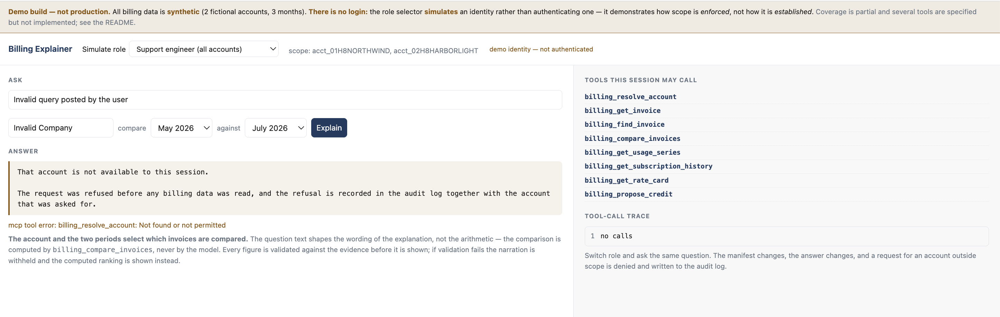
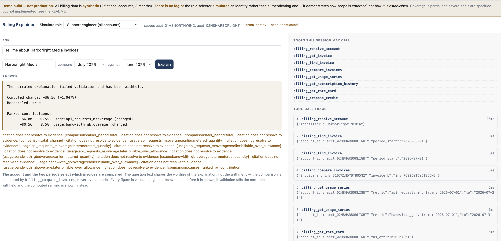

# Walkthrough

Two parts: **[what it does](#what-it-does)** (five screens), and **[running it
yourself](#running-it-yourself)**.

Nothing here is a mockup — every screenshot is the running application against
the seeded fixture.

---

## What it does

### 1. The question

*"Why did Northwind Analytics' invoice go up in July?"*

Answering this by hand means opening four systems and reconciling them:
subscriptions, usage metering, invoicing, and the ledger. That's why it becomes
a support ticket routed to an engineer.


**Read the right-hand panel first.** That's the tool-call trace — every call the
agent made, in order, with its arguments. The panel is *evidence*, not
decoration: it's how you can tell the answer came from the billing systems
rather than from the model's priors.

The investigation runs as a durable Workflow: resolve the account → locate both
invoices → compare → pull supporting evidence for each material cause → compose.

**The numbers are not the model's.** `billing_compare_invoices` computes the
delta as a full outer join on a stable line key, ranks it by contribution, and
hands the model a result it is explicitly forbidden to do arithmetic on:

```
 $136.00   50.2%   Usage step change (API +64M requests, bandwidth +100 GB)
  $85.16   31.4%   Add-on activated 16 Jul, prorated 16/31 days
  $50.00   18.4%   LAUNCH_CREDIT promotional discount expired
 -------   -----
 $271.16  100.0%   = 39.994% of June
```

Three causes of clearly different sizes, summing to the whole change with no
residue. The smallest — an expired discount — is the one a human scanning a
dashboard reliably misses, and it's detected as a `NULL` on one side of a join
rather than inferred from a total that moved.

### 2. The same question, refused

Ask about an account this session cannot reach — one belonging to a different
tenant, or one that does not exist at all. Both answer the same way:



> That account is not available to this session. The request was refused before
> any billing data was read, and the refusal is recorded in the audit log
> together with the account that was asked for.

Three things worth noticing:

- **The refusal happens before any read.** The tool-call trace beside it is
  empty — nothing was fetched and then discarded. Scope is checked against the
  signed session token, not against the argument that was passed.
- **"Not found" and "not permitted" are indistinguishable** to the caller, so
  the error cannot be used to enumerate which accounts exist. The audit log
  records which it actually was.
- **It's an outcome, not a crash.** A scope refusal is returned as a value, so
  the system answers plainly instead of surfacing a stack trace.

For the cross-tenant version of the same refusal, switch the role selector to
**Customer** and ask about **Harborlight Media**.

### 3. The manifest changes with the role

Same server, same data, same page — different session tokens.

The **TOOLS THIS SESSION MAY CALL** panel in the screenshots above is not a
static list — it is what the server returned to `tools/list` for that session's
token. The support-engineer session shows eight tools, ending in
`billing_propose_credit`. Switch the selector to **Customer** and the panel
redraws with seven: `billing_propose_credit` is gone, and the scope line beside
the selector narrows to a single account.

A customer session never sees `billing_propose_credit` **in its manifest at
all**. Hiding the tool isn't the security control — the scope check is — but a
tool the model has never been told exists cannot be reached by an injected
instruction.

This panel renders what the **server** returned to `tools/list`. The UI displays
the decision; it doesn't make it.

### 4. There is no way to move money

The one write tool a support engineer gets is `billing_propose_credit`. It
creates a `PENDING` proposal with evidence references and returns a signed
approval URL. **It does not apply a credit.**

`billing_apply_credit` does not exist anywhere in the codebase — there's a test
that fails if anyone adds it. A human, never the proposing principal, approves
in a separately authenticated surface, and the server applies it.

In one line: an in-band confirmation flag puts the gate in the same trust domain
as the thing being gated. The control here is that **the credential required to
approve is one the model never holds.**

Full argument: [DESIGN §2](DESIGN.md#2-the-agents-write-surface-is-its-own-workspace-never-the-ledger).

### 5. It's verified, not asserted

24 tests across two projects, plus 24 assertions on the fixture arithmetic
before any agent runs.

The behavioural tests cover the cross-tenant denial and its audit record, column
projection by role, and the July comparison asserted against the real fixture.
The **structural** tests are the more unusual half — they scan the source tree
to assert that the shape which makes the behaviour hard to get wrong is still in
place:

- the database binding is referenced in exactly one module;
- no module outside `ScopedDb` builds SQL against billing tables;
- no `apply_credit` path exists;
- the audit DDL is not loaded into the operational database.

Those fail CI rather than review, which is the point: they catch the refactor
that quietly removes a guarantee.

### When the model is wrong

The narration is checked before it is shown. Here the model invented a citation
— `[event: none, as there are no change events]`, which resolves to nothing —
and the answer was withheld:



The computed ranking is shown instead, with the specific problem named
underneath. This is the case the design exists for: a fluent, plausible billing
explanation that cites something which does not exist is the most expensive
output this system could produce, and it is the one a human reviewer is least
likely to catch by reading.

The validator checks four things: every citation resolves to a real line key,
usage date or event id; every money figure appears verbatim in the evidence;
an unreconciled comparison is disclosed in the opening sentence; and no
commitment is made. On any failure the prose is withheld — **a deterministic,
ugly, correct answer beats a fluent one that cited something that does not
exist.**

### When the model is unavailable

> No narration was produced (*reason*). Computed evidence only.

…followed by the same ranked contributions. **This is designed behaviour, not a
fallback bolted on.** A billing system that still answers correctly when the
model goes away is the whole argument for keeping arithmetic out of the model.
It names the actual reason rather than saying "unavailable", because auth, model
access, rate limits and a missing binding all look identical from the outside
and which one you're looking at is the entire question.

---

## Running it yourself

### Prerequisites

- **Node 20+**
- **A Cloudflare account.** Free tier is enough. Workers AI has no local
  emulator, so the narration step needs a real account — everything else runs
  locally.

### Setup

```bash
npm install

npm run db:init          # schema.sql -> local D1
npm run db:seed          # 2 accounts, 3 months of fixture data
npm run verify:fixture   # 24 assertions on the demo arithmetic
npm test                 # 24 tests

npx wrangler login       # required for the AI binding
npm run dev
```

`npm run dev` generates `.dev.vars` with a random `SESSION_SECRET` on first run.
It is git-ignored; nothing secret is committed.

Open the URL wrangler prints, ask *"Why did Northwind Analytics' invoice go up
in July?"*, then switch the role selector to **Customer** and ask about
**Harborlight Media**.

### Two things that will bite you

**1. Run `wrangler dev` with no flags.**

| Command | D1 | AI binding |
|---|---|---|
| `wrangler dev --local` | local ✓ | **forced local → always fails** |
| `wrangler dev --remote` | remote ✗ (loses the local seed) | needs an edge-preview session |
| `wrangler dev` | local ✓ | **remote via proxy ✓** |

`--local` disables remote bindings entirely, so the AI binding reports
*"Binding AI needs to be run remotely"* no matter how the config reads. That
error names the symptom, not the cause.

**2. Remote bindings need a workers.dev subdomain on your account.**

Without one, the proxy that carries the AI binding can't be established and you
get the same message. Register one at **Workers & Pages → Account details →
Subdomain** in the Cloudflare dashboard. It takes a minute and you never use the
subdomain for anything else.

### A harmless error you will see in `wrangler dev`

Running locally, the console logs this after each model-backed investigation:

> The Workers runtime canceled this request because it detected that your
> Worker's code had hung and would never generate a response.

**It does not affect responses** — every request returns, and answers are
correct. It comes from wrangler's remote-bindings proxy holding the Workers AI
subrequest open, not from application code. Bisected: with the AI call failing
fast (an invalid `AI_MODEL`) the error disappears; with the page merely loaded
and no investigation run, it never appears at all.

It cannot occur on a deployed Worker, where the AI binding is native and no
proxy sits in the path.

### If the narration doesn't appear

The answer box names the reason in parentheses. Most likely: the default model
isn't enabled on your account. List what you have and pick one:

```bash
npx wrangler ai models list | grep -i llama
```

Then set it in `.dev.vars` and restart — no code change:

```
AI_MODEL=@cf/meta/llama-3.1-8b-instruct-fp8
```

Smaller models are more likely to fail the output validator, which is not a
malfunction: the narration is withheld and the computed ranking is shown, with
the specific problems listed underneath.

### Fixture reference

| Account | Period | Total |
|---|---|---|
| Northwind Analytics | May 2026 | $666.80 |
| Northwind Analytics | June 2026 | $678.00 |
| Northwind Analytics | July 2026 | **$949.16** |
| Harborlight Media | May 2026 | $621.60 |
| Harborlight Media | June 2026 | $626.80 |
| Harborlight Media | July 2026 | $620.24 |

Northwind July vs June is the demo case. Harborlight is a deliberately boring
control — flat usage, no add-on, no discount, no change events — so that "the
invoice went up 40% for three reasons" reads as a finding rather than as how
this system always talks.

Account names must be typed exactly; `billing_resolve_account` matches an id or
a full case-insensitive name, with no partial matching.

---

**Next:** [Why it's built this way](DESIGN.md) · [Tool surface and
authorization boundary](tool-surface.md) · [Data model, fixture arithmetic and
tenancy leaks](data-model.md)
